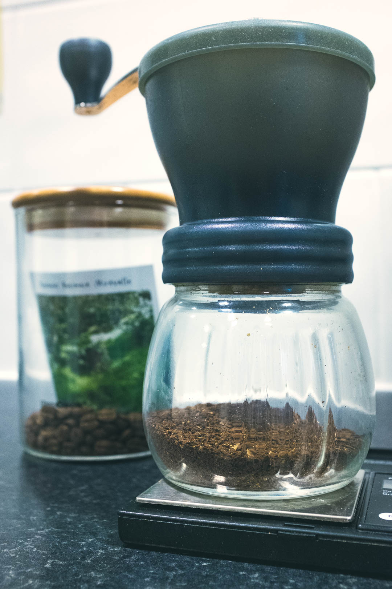
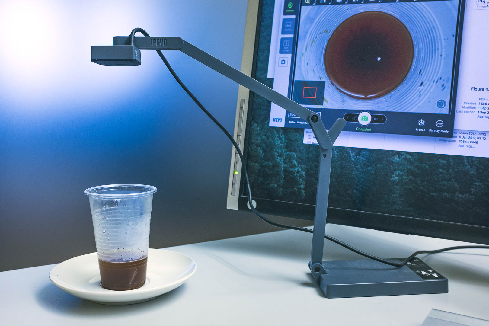
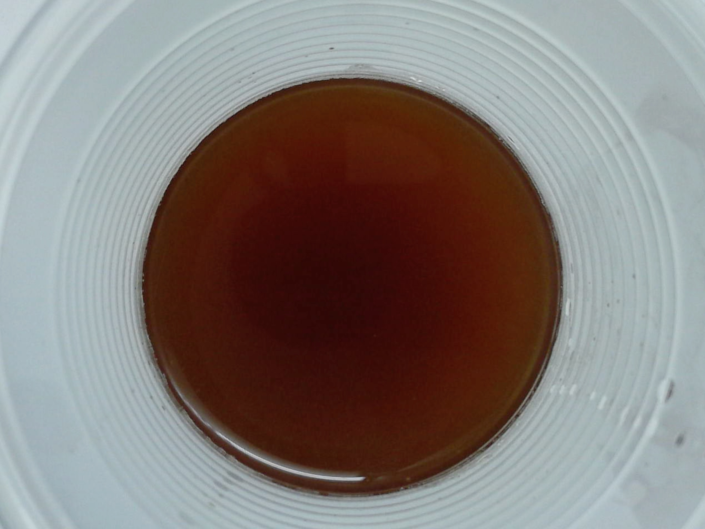
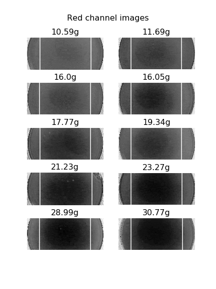
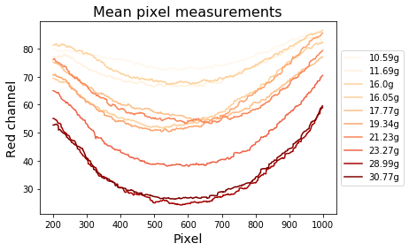
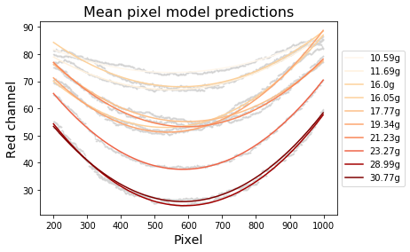
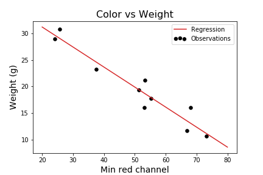

# Coffee Concentration and Color

I used to get a coffee beans from a terrific vendor in the Cambridge Market. One of the issues with working at the Wellcome Genome Campus is that it's hard to get the time to reach the town center while the market is still open. After having missed the opportunity too many times, I decided to start a coffee subscription. Along with some nice coffee, the beans came with suggested brewing instructions, and something that surprised me was the concentration of coffee suggested (coffee:water ratio). My coffee maker is 355 ml, and the suggested weight of coffee for this volume is 30g. Normally I make coffee with 14g, so this was far more than I'd considered using! 

To check if I could get a better tasting cup of coffee, I started trying random weights between 10g and 30g, checking the taste. I also thought I could use this opportunity to test something else with the data this would generate.

When I get good coffee at nice coffee places, it tend to have a particular red-brown color, a color which is different from when I make it myself. I was wondering what the relation was between coffee concentration (grams of coffee in ml of water) and the color.

The coffee I was drinking the week I did these measurements was Honduras Guaimaca Miravalle.

I set up a rig to take a pictures of a sample of the coffee for each weight I tried. A benefit of being in a small office with no windows to the outside is that the light levels on the coffee should be constant throughout the day. I tried 10 different weights from 200g of coffee.

I took the pictures head on, and once I'd run out of coffee I aligned and cropped the images to make quantitative comparisons.

I read in the files in Python using [scikit-image](), and extracted the red channels from the images.

To quantify the dependence on weight, we need to summarize the images somehow. First I looked at the mean red channel values over the length of the images between the white bars indicated above.

It seems the minimum of these values could be a good representation of the color intensity. To make sure we're not capturing some outlier pixel value for one of the weights, I smooth the data by fitting a 2nd degree polynomial to the intensity values over the pixels using [statsmodels]().

Now we summarize the curves by taking the minimum. Finally, we try to predict the weight of coffee used from the color using simple linear regression.

With an R-squared of 0.923, we see that the weight is well predicted by the color.

The analysis is available in a Jupyter notebook [here]().

Regarding the flavour, I think I ended up liking a weight of ~20g the best, for this lighter coffee.

